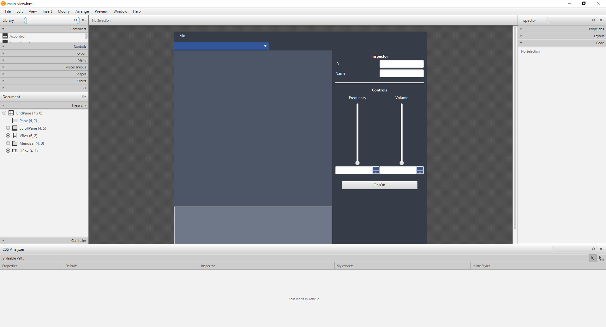
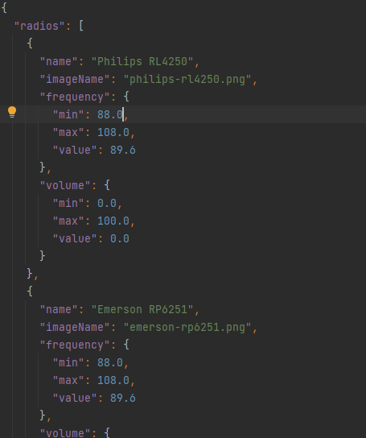
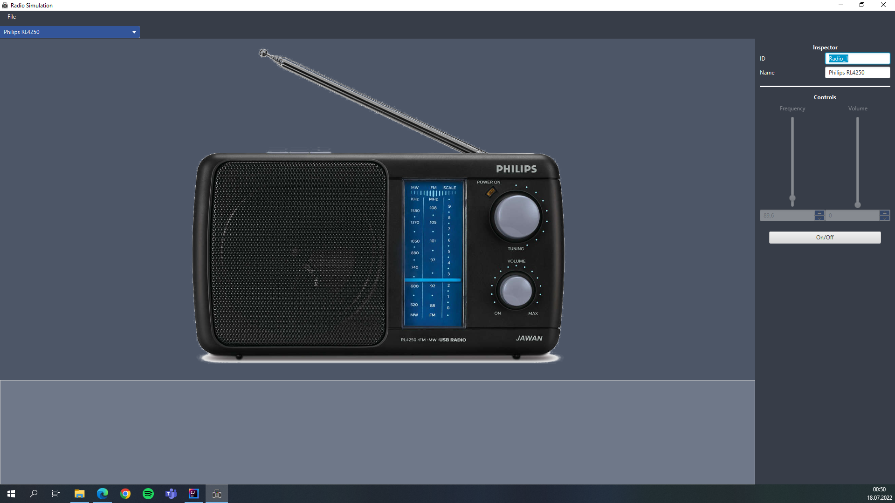

# In Progress

This project is still under development. Following tasks are still incomplete:

- [ ] add id generation
- [ ] add java fx media player
  - [ ] add maven dependency
  - [ ] add module info
- [ ] create preference window
  - [ ] create stage
  - [ ] add appearance options
  - [ ] build appearance to css adapter
- [ ] extend logger
  - [ ] add new messages
  - [ ] create txt writer
  - [ ] create output file
- [ ] create detailed README
- [ ] finish code documentation
- [ ] write tests
- [ ] check for code safety
- [ ] check for code coverage

---

# Radio Sim

The target for this project was to develop a simple radio simulation.

## Challenges

In order to develop this simulation, I had to tackle numerous challenges.

- developing in java
  * i've got very little experience programming in java
  * i don't know how to structure a project in java
- creating a gui using javafx
  * never used javafx --> whole new framework to learn
- using maven
  * never used maven before
- time

## Development

In order to create the gui faster, the application scenebuilder was used. It is an open source tool developed for creating javafx ui's.

The simulation should be able to display different types of radios. Therefore, a json file was used as simple "database" to provide an easy to read interface between computer and user. Moreover, it is easy extandable.

As shown above, the ui is kept simple because of the small dimension of the overall task. While the MainView shows the selected radio, the user can change the volume and the frequency through the inspector. In the bottom left hand corner one can see the log for the current run.

## Future Development

In the future, modules could be added in order to make the MainView more lively. Those modules could make the radio pictures interactive, thus, making the simulation more realistic.
